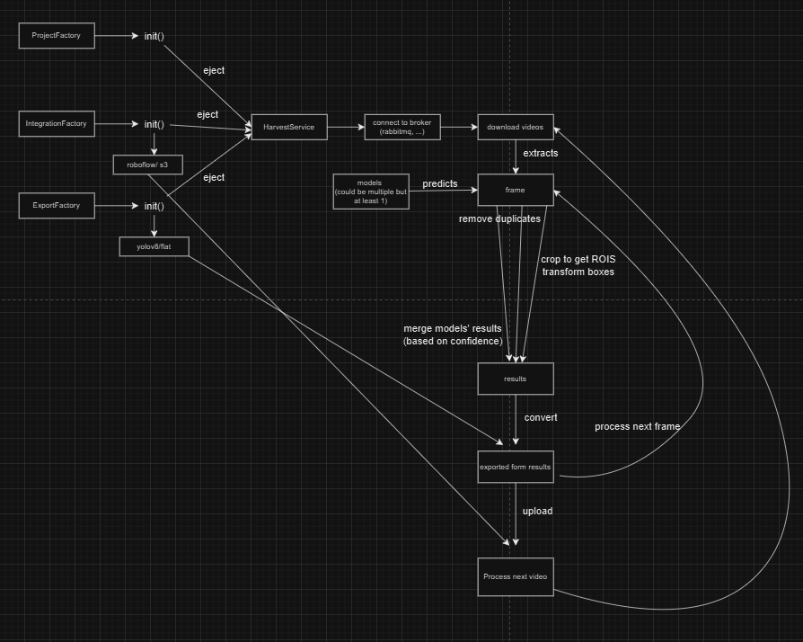
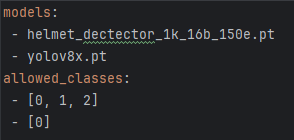
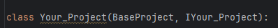

# Data harvesting

One of the most important steps in data science or the development of machine learning models is the collection of data. Having high-quality data is the key ingredient to training any successful algorithm. Unfortunately, collecting data, especially qualitative data, is one of the most complicated steps. Imagine you want to train a model that recognizes people wearing purple sunglasses, a red shirt, and yellow shoes. Think about it, where would you be able to find a dataset that includes people meeting those criteria? It would not be an easy task, right?

In most cases, data scientists spend a significant amount of their time finding the correct data, and this is typically a very time-consuming task. Especially in the world of video, typically terabytes of data are analyzed or labeled manually, and most of the time the correct dataset is not readily available. To make it even worse, machine learning models require up-to-date training data, which means that collecting data is not a one-time job; it's a continuous process that never stops. This means that the developers of these models require an automated and smart approach for creating those datasets. This is where data filtering becomes crucial for the concept of automated dataset harvesting.

Automated dataset harvesting involves using algorithms and tools to continuously collect, filter, and update datasets to ensure they meet the required criteria for training machine learning models. This approach not only saves time but also ensures that the data remains relevant and high-quality, which is essential for the success of any machine learning project.

## What's in this project

This project contains several key components responsible for different stages of the data harvesting process:

### Folder structure:
- #### `models/`:
  - Contains all the pretrained models used for making predictions, newly added models should be moved to this folder as this will be read automatically while triggering models.
  - The models should be `YOLO` compatible since they are accessed uniformly using `ultralytics/YOLO`.
- #### `projects/`:
  - Contains the implementation for different projects using `Factory Pattern`. First time hearing about this term? 
    - Short explanation: The underlying principle is to create objects without exposing the creation logic to the client, rather defining a common interface to refer to the newly created objects. So the newly added part of the Factory could be called directly via `init()`. 
    - Long explanation: [Learn more](https://refactoring.guru/design-patterns/factory-method)
  - Each project might have the specific conditions/requirements for the models. 
    - We added `helmet` project as an example: In this project, Person and Helmet need to appear in the frame, and the bounding boxes of Person need to be minimum `min_height` and `min_width` parameters,... . Those specific conditions could be read and handled via `condition_func` abstracted and relevant parameters could be found in `project_config.yaml`.
- #### `exports/`:
  - Handles the conversion of prediction results into exportable format, also supports dataset versioning.
  - After prediction of the entire video is made, the results need to be formatted before being uploaded. This folder contains logic for converting results into supported format, currently have:
    - `yolov8`: Works for YOLOv8 (tested) and others Ultralytics YOLO models, more information about the directory structure [here](https://docs.ultralytics.com/datasets/detect/#:~:text=Supported%20Dataset%20Formats-,Ultralytics%20YOLO%20format,-The%20Ultralytics%20YOLO)
    - `flat`: Basically keeps both image and annotation in the same directory.
- #### `integrations/`:
  - Manages cloud platform interactions, specifically uploading and downloading dataset.
  - After the predictions are processed and exported to dedicated format, this module handles the uploading of the final dataset, currently have:
    - `s3`: Any S3 compatible platform such as wasabi,... You need to provide the following necessary variables in `.env` file under `S3 parameters`: `S3_ENDPOINT`, `S3_ACCESS_KEY`, `S3_SECRET_KEY`, `S3_BUCKET`.
    - `roboflow`: common platform for storing and managing deep learning dataset [see more](https://app.roboflow.com/). You need to provide the following necessary variables in `.env` file under `Roboflow parameters`: `RBF_API_KEY`, `RBF_WORKSPACE`, `RBF_PROJECT`.
- #### `services/`:
  - Contains the core logic for the harvesting service.
  - Manages tasks such as ejecting other components, reads keys the message broker and from your vault, extracting frames from videos, evaluating video content, and deleting media after it’s processed.

### Interesting files:
Beside the well organized directory structure above, below files are also interesting:
- `single-shot.py`: This is a test version of the harvesting process, designed to work with a single video. It allows you to test and validate the extraction and processing pipeline on a smaller scale before applying to the scaled up `queue_harvesting.py`.
- `queue_harvesting.py`: The main script of the project that acts as the controller for managing the workflow and interactions between different components. This script orchestrates the entire data harvesting process, ensuring seamless integration with cloud resources and data repositories.
- `condition.py`: Handles the logic for model predictions. Manages how models are applied to the frames, controlling the conditions for predictions and processing.
  - It performs object detection using list of YOLO models as defined in `project_config.yaml`. For each model, uses YOLO Object Tracking: `MODEL.track()` method is used to perform object detection on the frame. Tracking is enabled to maintain unique IDs for detected objects across frames.
    - For more information and parameter please check: [YOLOv8 model.track](https://docs.ultralytics.com/modes/track/)
  - After processed, results are merged and sorted based on accuracy, and mapped based on labels of the first model.
  - Duplicate removal: To avoid duplicated boxes detected for an object, by get rid of boxes that have the same label and similar coordinate as the highest accuracy box.
  - Crop frame and transform annotations: To reduce storage waste while storing the dataset, frames are cropped to get only ROIs (Region of Interest) areas, then transform the annotations accordingly to fit the frame.
- `.env`: This file contains environment-specific variables that are used to configure the scripts without hard-coding sensitive information. Typical variables might include API keys, database URLs, or credentials needed to access cloud services. Ensure that this file is properly configured before running the scripts, and keep it secure to prevent unauthorized access.

## Get started:
To quickly get started with the **data-harvesting** repo and set up a new project, follow these steps:
1. **Add pretrained models:**
   - Place your pre-trained model(s) in the [`models/`](#models) folder.
   - These models will be used for making predictions during the data processing pipeline.

2. **Configure `.env`:**
   - Open the `.env` file in the root of the repository.
   - Add a new entry for your project by setting the `PROJECT_NAME` variable to the name of your project folder:
     - For example: `PROJECT_NAME=your_project_name`

3. **Create a New Project:**
   - In the [`projects/`](#projects) folder, create a new folder for your project.
   - Inside this folder, define the project-specific logic.
   
4. **Register the Project with `Project_Factory`:**
    - In the `projects/` folder, locate and update the `Project_Factory.py` file.
    - Add the path to your newly created project by importing it and registering it in the factory pattern under your newly created `your_project_name` in step 2. This ensures that your project can be initialized dynamically when selected without affecting other parts.

5. **Add Project Configuration**
    - Create a project_config.yaml file in your project folder. it should have these compulsory formats:
        
    - Where `models` are list of used models, should be at least 1, and `allowed_classes` are according classes/labels that you want the model to predict.
    - Besides, you can add optional parameters below, they should be easily called in the project.

6. **Implement Project Logic:**
    - Inside your new project folder, reference the base class provided by the repository.
        
      
    - Implement the following:
      - `condition_func`: Define how your project will handle model predictions and conditions.

Once you’ve completed these steps, your new project will be ready for integration with the data-harvesting pipeline!