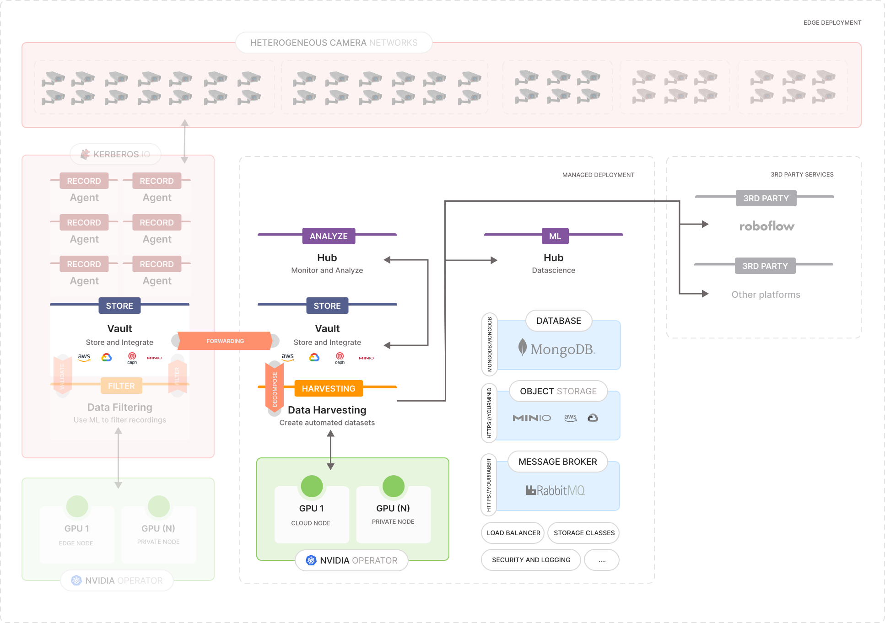

# Data harvesting

One of the most important steps in data science or the development of machine learning models is the collection of data. Having high-quality data is the key ingredient to training any successful algorithm. Unfortunately, collecting data, especially qualitative data, is one of the most complicated steps. Imagine you want to train a model that recognizes people wearing purple sunglasses, a red shirt, and yellow shoes. Think about it, where would you be able to find a dataset that includes people meeting those criteria? It would not be an easy task, right?

In most cases, data scientists spend a significant amount of their time finding the correct data, and this is typically a very time-consuming task. Especially in the world of video, typically terabytes of data are analyzed or labeled manually, and most of the time the correct dataset is not readily available. To make it even worse, machine learning models require up-to-date training data, which means that collecting data is not a one-time job; it's a continuous process that never stops. This means that the developers of these models require an automated and smart approach for creating those datasets. This is where data filtering becomes crucial for the concept of automated dataset harvesting.

Automated dataset harvesting involves using algorithms and tools to continuously collect, filter, and update datasets to ensure they meet the required criteria for training machine learning models. This approach not only saves time but also ensures that the data remains relevant and high-quality, which is essential for the success of any machine learning project.

## What's in this project

This project contains several key components responsible for different stages of the data harvesting process:

- `single-shot.py`: This is a test version of the harvesting process, designed to work with a single video. It allows you to test and validate the extraction and processing pipeline on a smaller scale before applying to the scaled up `queue_harvesting.py`.
- `queue_harvesting.py`: The main script of the project. It reads keys the message broker and from your vault, processes videos based on these keys, extracts relevant frames, and then uploads them to Roboflow. This script orchestrates the entire data harvesting process, ensuring seamless integration with cloud resources and data repositories.
- `condition.py`: This script is responsible for frame extraction and parameter configuration. It defines the conditions under which frames from videos are extracted, ensuring only relevant data is processed, in this project we are using dual validation, which means we pass the frame into 2 models (could be the same or different model, but make sure they share them same classes).
  - For example: if model 1 has 3 classes: 0 - Person, 1 - Helmet, 2 - Head. Model2 has to have the same classes with the same order.
- `.env`: This file contains environment-specific variables that are used to configure the scripts without hard-coding sensitive information. Typical variables might include API keys, database URLs, or credentials needed to access cloud services. Ensure that this file is properly configured before running the scripts, and keep it secure to prevent unauthorized access.

### `single-shot.py`

- Let's start with the test version that works with a single video.
- Environment Variables Setup: The script initializes environment variables through the VariableClass, which holds important configurations reading from `.env` file.
- We use the YOLO (You Only Look Once) model for object detection, letting the frame be predicted by these 2 models, compare and get the result with higher accuracy, see more at [condition.py](#conditionpy).
  The device (CPU or GPU) is automatically selected based on availability.
- Object Classification:
  - We process the video by skipping frames based on the configured `frame_skip_factor` and `skip_frames_counter` to optimize performance, since we want the dataset to be diversity, 2 consecutive frame does not hold much useful information about the object.
  - For each processed frame, the processFrame function is used to detect objects and check if the condition is met (e.g., detecting a certain number of people), see more at [condition.py](#conditionpy).
  - If the condition is met, the relevant frame and associated labels/boxes are saved, and further frames are skipped for efficiency.
- Result handling:
  - If any frames meet the condition, they are uploaded to Roboflow.

### `queue_harvesting.py`

- Scaled up version of `single-shot.py`. Hence, the code logic is exactly the same except the message broker connection. By doing this it can continuously process videos from the cloud.

### `condition.py`

- The file is responsible for processing video frames to detect objects using pre-trained models (YOLO) and applying custom logic to determine if certain conditions are met (e.g., detecting a specific number of objects with certain attributes). If the conditions are met, the relevant frames and associated labels/boxes are prepared for further processing or storage.
- Frame Processing:
  - `processFrame` function: This is the core function that takes a video frame, performs object classification using two YOLO models, and checks whether the detection results satisfy predefined conditions.
  - YOLO Object Tracking: The `MODEL.track()` method is used to perform object detection on the frame. Tracking is enabled to maintain unique IDs for detected objects across frames.
    - For more information and parameter please check: [YOLOv8 model.track](https://docs.ultralytics.com/modes/track/)
  - Dual-Model Support: We use a secondary model (MODEL2) to enhance the detection process by combining results from two different models.
