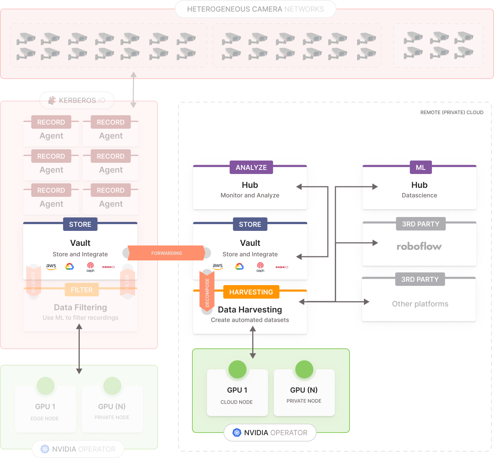

# Data harvesting

One of the most important steps in data science or the development of machine learning models is the collection of data. Having high-quality data is the key ingredient to training any successful algorithm. Unfortunately, collecting data, especially qualitative data, is one of the most complicated steps. Imagine you want to train a model that recognizes people wearing purple sunglasses, a red shirt, and yellow shoes. Think about it, where would you be able to find a dataset that includes people meeting those criteria? It would not be an easy task, right?

In most cases, data scientists spend a significant amount of their time finding the correct data, and this is typically a very time-consuming task. Especially in the world of video, typically terabytes of data are analyzed or labeled manually, and most of the time the correct dataset is not readily available. To make it even worse, machine learning models require up-to-date training data, which means that collecting data is not a one-time job; it's a continuous process that never stops. This means that the developers of these models require an automated and smart approach for creating those datasets. This is where data filtering becomes crucial for the concept of automated dataset harvesting.

Automated dataset harvesting involves using algorithms and tools to continuously collect, filter, and update datasets to ensure they meet the required criteria for training machine learning models. This approach not only saves time but also ensures that the data remains relevant and high-quality, which is essential for the success of any machine learning project.

## What's in this project

@ TODO
